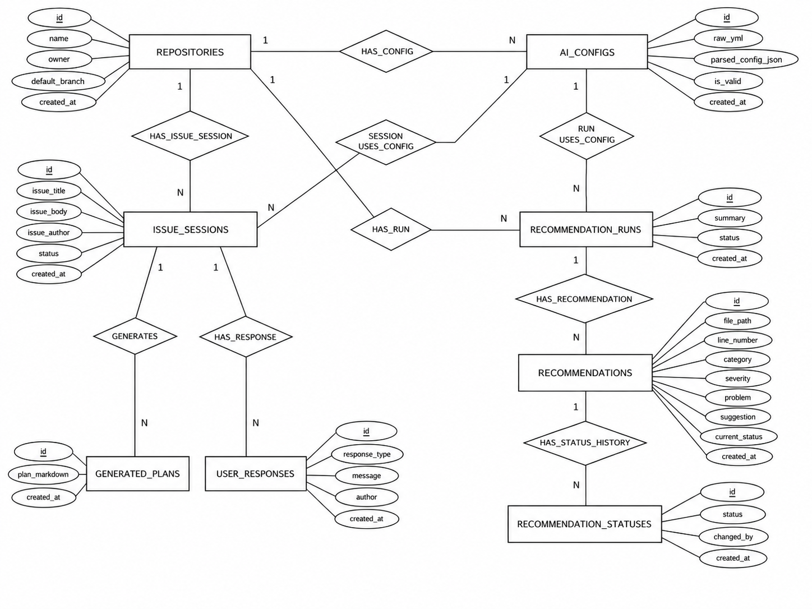

# Database Schema

## English

This diagram describes the first version of the database structure for the GitFlame CodePilot MVP. The goal of the schema is to keep the two main product flows separated, but still connected through the same repository and configuration data.

The first flow is issue-based code generation. GitFlame sends repository metadata, issue data, and the `.yml` configuration to the backend. The backend creates an issue session, stores the generated Markdown plan, and records the user's response: approve, correct, or reject.

The second flow is repository recommendations. The backend receives repository context and configuration, runs analysis through the ML service, stores the analysis summary, and saves separate recommendation cards that can later be displayed, closed, or deleted.

The schema is intentionally simple for Sprint 1. It is not a final production schema yet, but it shows which data we need to store and how the main entities are connected.

### Main Idea

`repositories` is the root entity. Almost every other record is connected to a repository, because both MVP flows start from a GitFlame repository.

`ai_configs` stores snapshots of the `.yml` configuration. I keep it as a separate table because the config can change over time, and old plans or recommendations should still point to the exact config version that was used when they were created.

The issue workflow is represented by `issue_sessions`, `generated_plans`, and `user_responses`. This lets the backend store the original issue, one or more generated plans, and all user decisions related to that issue.

The recommendation workflow is represented by `recommendation_runs`, `recommendations`, and `recommendation_statuses`. The run stores the overall analysis result, while each recommendation is stored as a separate card with its own status history.

### Entities And Attributes

`repositories`

- `id`: primary identifier of the repository.
- `name`: repository name.
- `owner`: repository owner or namespace.
- `default_branch`: default branch received from GitFlame.
- `created_at`: creation timestamp in our system.

`ai_configs`

- `id`: primary identifier of the configuration snapshot.
- `repository_id`: reference to the repository.
- `raw_yml`: original `.yml` content.
- `parsed_config_json`: parsed version of the configuration, planned as PostgreSQL `JSONB`.
- `is_valid`: result of configuration validation.
- `created_at`: timestamp when this config snapshot was saved.

`issue_sessions`

- `id`: primary identifier of the issue workflow session.
- `repository_id`: repository where the issue was created.
- `ai_config_id`: configuration snapshot used for this session.
- `issue_title`: issue title received from GitFlame.
- `issue_body`: issue description.
- `issue_author`: author of the issue.
- `status`: current session status.
- `created_at`: session creation timestamp.

`generated_plans`

- `id`: primary identifier of the generated plan.
- `issue_session_id`: issue session this plan belongs to.
- `plan_markdown`: generated implementation plan in Markdown.
- `created_at`: timestamp when the plan was generated.

`user_responses`

- `id`: primary identifier of the response.
- `issue_session_id`: related issue session.
- `response_type`: approve, correct, or reject.
- `message`: optional user message or correction text.
- `author`: user who sent the response.
- `created_at`: response timestamp.

`recommendation_runs`

- `id`: primary identifier of the analysis run.
- `repository_id`: repository that was analyzed.
- `ai_config_id`: configuration snapshot used for the analysis.
- `summary`: short summary returned by the ML service.
- `status`: run status, for example pending, completed, or failed.
- `created_at`: run creation timestamp.

`recommendations`

- `id`: primary identifier of the recommendation card.
- `recommendation_run_id`: analysis run that produced the card.
- `file_path`: related file path.
- `line_number`: related line number, nullable because some recommendations may describe a whole file or module.
- `category`: recommendation category.
- `severity`: recommendation severity.
- `problem`: problem found by the analyzer.
- `suggestion`: suggested improvement.
- `current_status`: current card status.
- `created_at`: timestamp when the recommendation was saved.

`recommendation_statuses`

- `id`: primary identifier of the status history record.
- `recommendation_id`: recommendation whose status was changed.
- `status`: new status value.
- `changed_by`: user or system actor that changed the status.
- `created_at`: timestamp of the status change.

### Notes For Implementation

For PostgreSQL, the main identifiers should be stored as `UUID`. Time fields should use `TIMESTAMPTZ`, and the parsed config should use `JSONB`. The Go model templates use the same idea: UUID-like identifiers, `time.Time` for timestamps, and JSON-friendly fields for parsed configuration data.

The diagram does not include every possible future field. For Sprint 1, it is enough to describe the storage structure for generated plans, user responses, recommendation runs, recommendation cards, and recommendation status history.

## Русский

Эта диаграмма описывает первую версию структуры базы данных для MVP GitFlame CodePilot. Основная идея схемы в том, чтобы разделить два главных сценария продукта, но при этом связать их через общие данные репозитория и конфигурации.

Первый сценарий связан с генерацией плана по issue. GitFlame передает backend-у данные репозитория, данные issue и `.yml` конфиг. Backend создает сессию по issue, сохраняет сгенерированный Markdown-план и записывает ответ пользователя: approve, correct или reject.

Второй сценарий связан с рекомендациями по репозиторию. Backend получает контекст репозитория и конфигурацию, запускает анализ через ML-service, сохраняет общий summary и отдельные recommendation cards, которые потом можно показать в интерфейсе, закрыть или удалить.

Схема специально оставлена достаточно простой для Sprint 1. Это еще не финальная production-схема, но она показывает, какие данные нужно хранить и как основные сущности связаны между собой.

### Общая идея

`repositories` является корневой сущностью. Почти все остальные записи связаны с репозиторием, потому что оба MVP-сценария начинаются с GitFlame repository.

`ai_configs` хранит snapshots `.yml` конфигурации. Я вынес конфиг в отдельную таблицу, потому что он может меняться со временем, а старые планы и рекомендации должны ссылаться именно на ту версию конфига, которая использовалась при их создании.

Issue workflow описывается таблицами `issue_sessions`, `generated_plans` и `user_responses`. Так backend может хранить исходное issue, один или несколько сгенерированных планов и все пользовательские решения по этой сессии.

Recommendation workflow описывается таблицами `recommendation_runs`, `recommendations` и `recommendation_statuses`. Run хранит общий результат анализа, а каждая рекомендация сохраняется отдельной карточкой со своей историей статусов.

### Сущности и атрибуты

`repositories`

- `id`: основной идентификатор репозитория.
- `name`: название репозитория.
- `owner`: владелец или namespace репозитория.
- `default_branch`: default branch, полученный от GitFlame.
- `created_at`: время создания записи в нашей системе.

`ai_configs`

- `id`: основной идентификатор snapshot-а конфигурации.
- `repository_id`: ссылка на репозиторий.
- `raw_yml`: оригинальное содержимое `.yml`.
- `parsed_config_json`: распарсенная версия конфига, в PostgreSQL планируется как `JSONB`.
- `is_valid`: результат валидации конфига.
- `created_at`: время сохранения snapshot-а.

`issue_sessions`

- `id`: основной идентификатор сессии issue workflow.
- `repository_id`: репозиторий, в котором создано issue.
- `ai_config_id`: snapshot конфигурации, использованный для этой сессии.
- `issue_title`: заголовок issue, полученный от GitFlame.
- `issue_body`: описание issue.
- `issue_author`: автор issue.
- `status`: текущий статус сессии.
- `created_at`: время создания сессии.

`generated_plans`

- `id`: основной идентификатор сгенерированного плана.
- `issue_session_id`: issue session, к которой относится план.
- `plan_markdown`: сгенерированный implementation plan в Markdown.
- `created_at`: время генерации плана.

`user_responses`

- `id`: основной идентификатор ответа.
- `issue_session_id`: связанная issue session.
- `response_type`: approve, correct или reject.
- `message`: сообщение пользователя или текст correction.
- `author`: пользователь, который отправил ответ.
- `created_at`: время ответа.

`recommendation_runs`

- `id`: основной идентификатор запуска анализа.
- `repository_id`: репозиторий, который анализировался.
- `ai_config_id`: snapshot конфигурации, использованный для анализа.
- `summary`: короткое summary, возвращенное ML-service.
- `status`: статус запуска, например pending, completed или failed.
- `created_at`: время создания запуска.

`recommendations`

- `id`: основной идентификатор recommendation card.
- `recommendation_run_id`: запуск анализа, который создал карточку.
- `file_path`: путь к связанному файлу.
- `line_number`: номер строки, nullable, потому что рекомендация может относиться ко всему файлу или модулю.
- `category`: категория рекомендации.
- `severity`: важность рекомендации.
- `problem`: найденная проблема.
- `suggestion`: предложенное улучшение.
- `current_status`: текущий статус карточки.
- `created_at`: время сохранения рекомендации.

`recommendation_statuses`

- `id`: основной идентификатор записи истории статуса.
- `recommendation_id`: рекомендация, у которой изменился статус.
- `status`: новое значение статуса.
- `changed_by`: пользователь или системный actor, который изменил статус.
- `created_at`: время изменения статуса.

### Заметки для реализации

Для PostgreSQL основные идентификаторы стоит хранить как `UUID`. Поля времени лучше делать как `TIMESTAMPTZ`, а распарсенный конфиг хранить как `JSONB`. Go-шаблоны моделей используют эту же идею: UUID-like identifiers, `time.Time` для timestamps и JSON-friendly поле для parsed config.

Диаграмма не включает все возможные поля на будущее. Для Sprint 1 достаточно описать storage structure для generated plans, user responses, recommendation runs, recommendation cards и recommendation status history.
