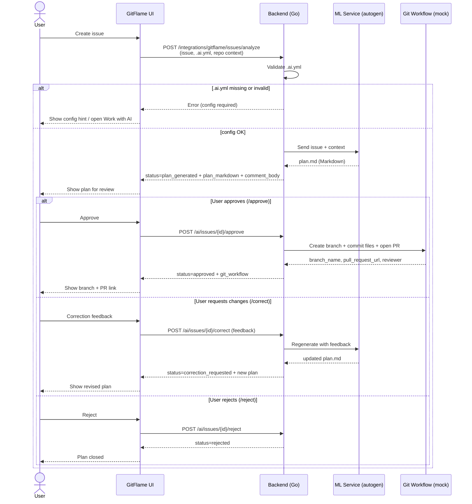
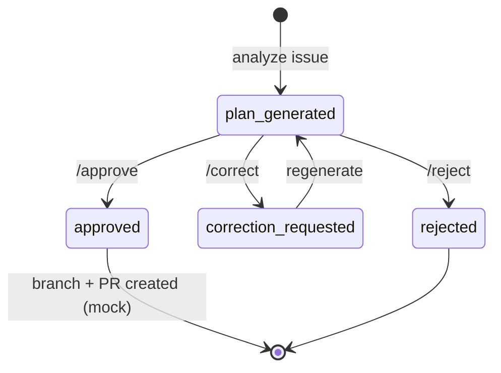

# User flow: Issue → Implementation Plan → Pull Request

This is the autogeneration scenario. The user creates an issue; the system checks
the `.ai.yml`, asks the ML service for an implementation plan, and only creates a
branch/PR after the user approves. Branch/PR creation is a **mock/contract-level**
service in Sprint 1 because the real GitFlame API may be unavailable.

## Plan states

Frontend mapping: this flow is implemented in
`frontend/src/components/IssuePlanPanel.vue`, opened from the **Work with AI**
button on the repository Code page.
