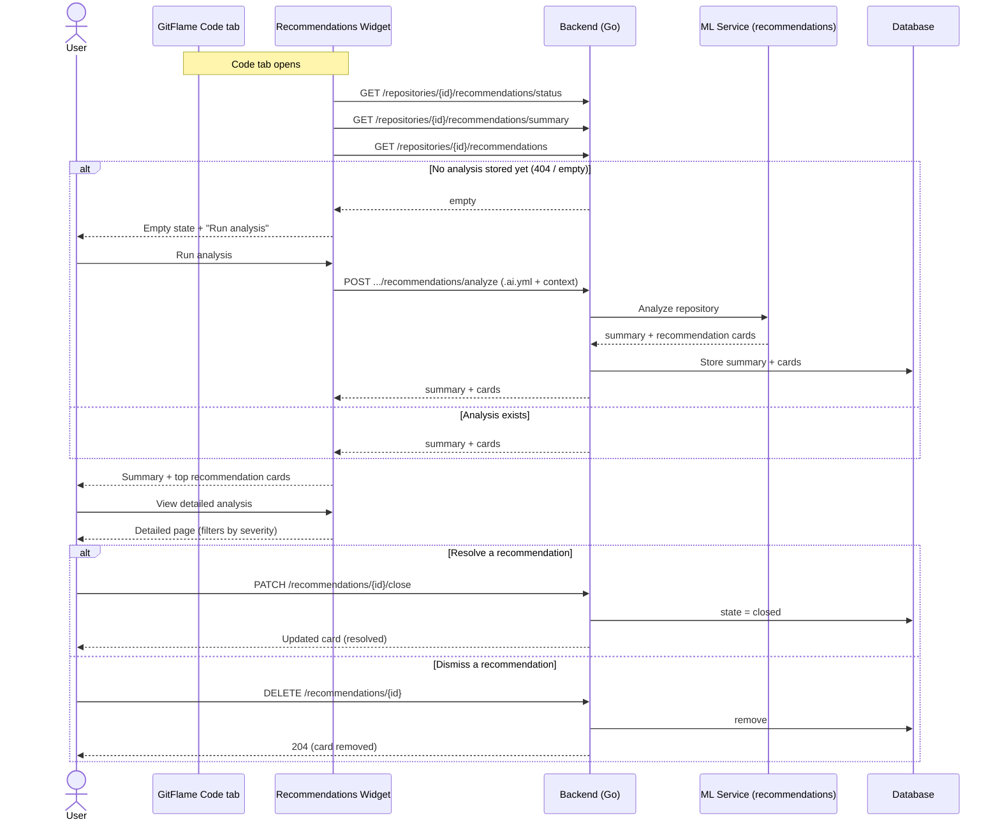
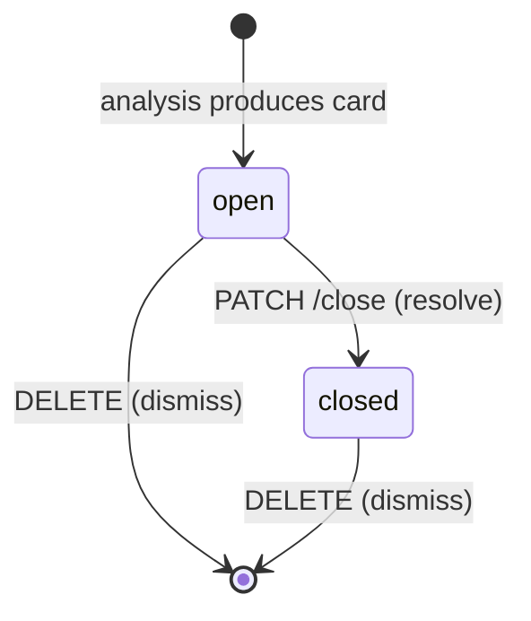

# User flow: Repository Recommendation Analysis

This is the recommendation scenario. When a `.ai.yml` is present, the system
analyzes the repository, produces a short summary and a list of recommendation
cards, stores them, and surfaces them in the widget on the Code tab plus a
detailed analysis page.

## Recommendation card states

## Recommendation card shape

Each card carries: `id`, `severity` (low | medium | high), `file`, optional
`line`, `problem`, `suggestion`, optional `confidence`, `state` (open | closed),
and an optional `category` (code_duplication | security | maintainability |
performance | architecture).

Frontend mapping: the widget is `frontend/src/components/RecommendationsWidget.vue`
(Code tab), and the full report is `frontend/src/views/DetailedAnalysisView.vue`
(route `/recommendations`).
