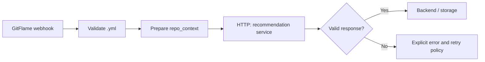

# Deployment Guide

## Deployment Decision

Sprint 1 supports the same API with a real model in three environments:

1. local Apple Silicon through Ollama;
2. a public Hugging Face Docker Space for synthetic demonstrations;
3. a university VM or paid GPU endpoint for longer-running integration.

There is no model-free runtime mode. If the model cannot be reached, the service returns an error.

## Local Apple Silicon

```bash
ollama pull qwen2.5-coder:1.5b
uv sync --dev
uv run uvicorn recommendation_service.app:app --host 0.0.0.0 --port 8000
curl http://localhost:8000/ready
```

The available M3 Pro with 18 GB unified memory can run all four tested quantized models one at a
time. The selected 1.5B model is the practical default; 7B models improve capacity at higher latency.

## Public Hugging Face Docker Space

Live Space: [`KarimKhab/gitflame-codepilot-recommendations`](https://huggingface.co/spaces/KarimKhab/gitflame-codepilot-recommendations)

The repository includes `Dockerfile`, `space_start.sh`, and Hugging Face Space metadata in
`README.md`. The container uses the benchmarked Ollama `0.18.2` runtime, starts Ollama, pulls
`qwen2.5-coder:1.5b`, then starts FastAPI on port `7860`.

The final container path was smoke-tested locally before upload. The built image was 2.22 GB; the
first model pull took approximately one minute; `/health`, `/ready`, and a real analysis request
all returned HTTP 200. These are local Docker CPU observations, not Hugging Face free-CPU latency
claims.

The live free CPU Space was smoke-tested on June 14, 2026. `/health`, `/ready`, and a synthetic
analysis request returned HTTP 200; the analysis request took approximately 52 seconds.

Free Space constraints:

- 2 vCPU, 16 GB RAM, and 50 GB non-persistent disk;
- CPU inference is slower than local Apple Silicon or GPU;
- the Space sleeps when unused and has a model-download cold start;
- a public Space exposes the API and source, so only synthetic or approved repository content may
  be submitted.

Deployment:

```bash
hf auth login
hf repos create <username>/gitflame-codepilot-recommendations --type space --space-sdk docker
hf upload <username>/gitflame-codepilot-recommendations . --type space
```

Smoke test after the Space finishes building:

```bash
curl https://<username>-gitflame-codepilot-recommendations.hf.space/health
curl https://<username>-gitflame-codepilot-recommendations.hf.space/ready
```

## University VM

Minimum usable CPU target for Qwen 1.5B quantized:

- Linux x86-64 or ARM64;
- 4 CPU cores recommended;
- at least 8 GB RAM, preferably 16 GB;
- at least 10 GB free disk;
- Docker or Python 3.12 plus Ollama.

GPU is not mandatory for the 1.5B model. If the VM has an NVIDIA GPU, at least 8 GB VRAM is a
practical starting point. Benchmark the VM before selecting it for a persistent deployment.

## Paid Options

Hugging Face GPU Spaces and dedicated Inference Endpoints are appropriate when predictable latency
or uptime is required. They are billed by active compute time; pause unused demo hardware. Record
the exact current price before provisioning because cloud prices can change.

## Future n8n Orchestration

n8n can make the integration flow visible without owning ML inference:



n8n is intentionally not a Sprint 1 runtime dependency. The FastAPI contract stays usable from
backend code, n8n, or any other orchestrator.

## Security Notes

- Never put Hugging Face tokens or repository credentials in source code.
- Do not submit private repository content to a public Space.
- Keep model selection server-controlled.
- Apply authentication, request-size limits, rate limits, and audit logging before production use.

## References

- [Hugging Face Spaces overview and hardware](https://huggingface.co/docs/hub/spaces-overview)
- [Hugging Face Inference Endpoint pricing](https://huggingface.co/docs/inference-endpoints/pricing)
- [Ollama structured outputs](https://docs.ollama.com/capabilities/structured-outputs)
