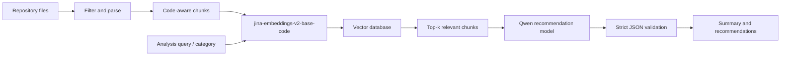

# Future RAG And Vector Search Direction

## Motivation

Sprint 1 sends a small, filtered repository context directly to the recommendation model. This is
appropriate for the MVP but does not scale to large repositories. The future DLS direction adds
code-aware retrieval before recommendation generation.

## Embedding Model

Candidate: [`jinaai/jina-embeddings-v2-base-code`](https://huggingface.co/jinaai/jina-embeddings-v2-base-code).

Reasons:

- specifically designed for code and natural-language retrieval;
- suitable for matching analysis questions to implementation chunks;
- open-source and deployable independently from the recommendation LLM;
- lets embedding, retrieval, and recommendation quality be measured separately.

## Planned Indexing Pipeline

1. Apply `.yml` include/exclude and size rules.
2. Parse files and split by functions/classes where possible; fall back to overlapping line chunks.
3. Store path, language, line range, symbol names, content hash, and repository revision as metadata.
4. Generate embeddings in batches.
5. Index at least 500,000 chunks for the DLS requirement.
6. Retrieve top-k candidates per analysis category and optionally rerank them.
7. Supply only the retrieved chunks, with exact path and line ranges, to the recommendation model.

## Planned Experiments

| Dimension | Iteration 1 | Iteration 2 |
| --- | --- | --- |
| Search | Exact cosine similarity | HNSW approximate search |
| Chunking | Fixed overlapping lines | Parser-aware function/class chunks |
| Embeddings | Full vector dimension | Reduced/quantized vectors |
| Candidate selection | Dense top-k | Dense top-k plus metadata filters/reranking |

Evaluation set: manually authored analysis queries with relevant chunk IDs across varied languages
and repository structures.

Metrics:

- retrieval quality: `precision@k`, `recall@k`, `nDCG@k`, and `MRR`;
- performance: p50/p95 latency, indexing time, embedding throughput, and memory/disk usage;
- downstream quality: recommendation precision/recall/F1 and invalid-reference rate;
- operational quality: incremental re-index time and stale-chunk rate.

The recommendation service contract remains unchanged; RAG changes how `repo_context` is selected,
not the final JSON response.

